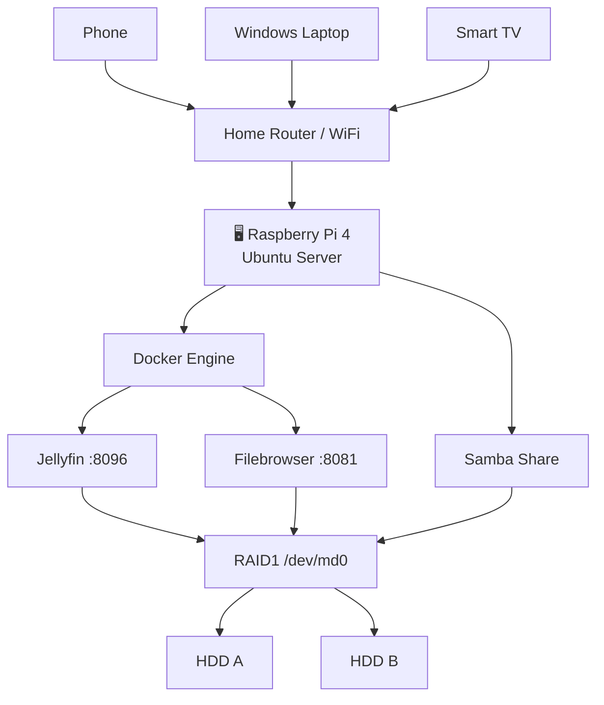

# ArthPi Home Server

A Raspberry Pi 4–based home server designed for reliable storage, media streaming, and automated health monitoring.

This project turns a Raspberry Pi into:

-  RAID1 mirrored storage (data redundancy)
-  Jellyfin media server
-  Samba network storage (Windows compatible)
-  Web-based file uploads (Filebrowser)
-  Docker-managed services
-  Automated disk & RAID health monitoring with email alerts

---

# Hardware

- Raspberry Pi 4B
- 2 × 750GB Seagate HDDs
- Blueendless HD05 dual-drive dock
- MicroSD card (OS only)

---

# System Architecture

## Storage Layer

- RAID Level: **RAID1 (Mirroring)**
- Device: `/dev/md0`
- Filesystem: `ext4`
- Mount point: `/mnt/raid`
- Auto-mount configured via UUID in `/etc/fstab`

RAID1 mirrors both disks.  
If one fails, the system continues running.

> RAID is redundancy, not backup.

---

## Directory Structure

```
/mnt/raid
├── media
│   ├── movies
│   └── series
│
└── docker
    ├── jellyfin
    │   ├── config
    │   └── cache
    └── filebrowser
        ├── config
        └── database
```

All important data lives on RAID — not on the SD card.

---

# Services

| Service      | Purpose                  | Port |
|-------------|--------------------------|------|
| Jellyfin    | Media streaming          | 8096 |
| Filebrowser | Web-based file manager   | 8081 |
| Samba       | Windows file sharing     | 445  |
| Portainer   | Docker management        | 9000 |
| Cockpit     | System admin panel       | 9090 |

---

# Access

- Jellyfin:  
  `http://10.0.0.50:8096`

- Filebrowser:  
  `http://10.0.0.50:8081`

- Samba (Windows):  
  `\\10.0.0.50\Media`

- SSH:  
  `ssh arth@10.0.0.50`

---

# Monitoring & Automation

The system includes automated monitoring:

- Daily RAID health check
- SMART disk health monitoring
- Disk temperature reporting
- Docker container status check
- Email alerts on failure
- Daily summary email at 7:00 AM

Health script location:

```
/usr/local/bin/arthpi-health.sh
```

---

# Documentation

Detailed guides:

- `01_PROJECT_OVERVIEW.md`
- `02_USER_GUIDE.md`
- `03_ADMIN_GUIDE.md`

---

# Current Status

- RAID healthy
- Monitoring active
- Email alerts working
- Media streaming functional
- One disk scheduled for replacement

---
##  Architecture Diagram



## Data Flow Diagram (Upload + Streaming)

```mermaid
flowchart LR

  %% Nodes
  Phone["Phone\nUploads"]
  Laptop["Windows Laptop\nDrag & Drop"]
  TV["Smart TV\nPlays Media"]
  Router["Home Router / WiFi"]
  Pi["Raspberry Pi 4\nUbuntu Server"]
  Filebrowser["Filebrowser\n:8081"]
  Samba["Samba (SMB)\n\\\\10.0.0.50\\Media"]
  Jellyfin["Jellyfin\n:8096"]
  RAID["RAID1 md0\n/mnt/raid"]
  Movies["/mnt/raid/media/movies"]
  Series["/mnt/raid/media/series"]

  %% Connectivity
  Phone -->|Wi-Fi| Router
  Laptop -->|Wi-Fi / Ethernet| Router
  TV -->|Wi-Fi| Router
  Router -->|LAN| Pi

  %% Upload Paths
  Phone -->|HTTP Upload| Filebrowser
  Filebrowser -->|Write files| RAID
  RAID -->|Store| Movies
  RAID -->|Store| Series

  Laptop -->|SMB File Copy| Samba
  Samba -->|Write files| RAID

  %% Streaming Path
  Jellyfin -->|Reads media| RAID
  TV -->|HTTP Stream| Jellyfin
  Phone -->|Optional playback| Jellyfin
  Laptop -->|Optional playback| Jellyfin

  %% Hosting
  Pi -->|Runs| Filebrowser
  Pi -->|Runs| Samba
  Pi -->|Runs (Docker)| Jellyfin
```


# Future Improvements

- Replace aging HDDs
- Improve cooling
- Upgrade to larger capacity drives
- Implement automated off-site backups

---

# License

Personal project. For educational and home use.

---

**ArthPi Home Server**  
Built for reliability, simplicity, and control.
