# ArthPi Home Server

A Raspberry Pi 4–based home server designed for reliable storage, media streaming, and automated health monitoring.

This project turns a Raspberry Pi into:

-  RAID1 mirrored storage (data redundancy)
-  Jellyfin media server
-  Samba network storage (Windows compatible)
-  Web-based file uploads (Filebrowser)
-  Docker-managed services
-  Automated disk & RAID health monitoring with email alerts

---

# Hardware

- Raspberry Pi 4B
- 2 × 750GB Seagate HDDs
- Blueendless HD05 dual-drive dock
- MicroSD card (OS only)

---

# System Architecture

## Storage Layer

- RAID Level: **RAID1 (Mirroring)**
- Device: `/dev/md0`
- Filesystem: `ext4`
- Mount point: `/mnt/raid`
- Auto-mount configured via UUID in `/etc/fstab`

RAID1 mirrors both disks.  
If one fails, the system continues running.

> RAID is redundancy, not backup.

---

## Directory Structure

```
/mnt/raid
├── media
│   ├── movies
│   └── series
│
└── docker
    ├── jellyfin
    │   ├── config
    │   └── cache
    └── filebrowser
        ├── config
        └── database
```

All important data lives on RAID — not on the SD card.

---

# Services

| Service      | Purpose                  | Port |
|-------------|--------------------------|------|
| Jellyfin    | Media streaming          | 8096 |
| Filebrowser | Web-based file manager   | 8081 |
| Samba       | Windows file sharing     | 445  |
| Portainer   | Docker management        | 9000 |
| Cockpit     | System admin panel       | 9090 |

---

# Access

- Jellyfin:  
  `http://10.0.0.50:8096`

- Filebrowser:  
  `http://10.0.0.50:8081`

- Samba (Windows):  
  `\\10.0.0.50\Media`

- SSH:  
  `ssh arth@10.0.0.50`

---

# Monitoring & Automation

The system includes automated monitoring:

- Daily RAID health check
- SMART disk health monitoring
- Disk temperature reporting
- Docker container status check
- Email alerts on failure
- Daily summary email at 7:00 AM

Health script location:

```
/usr/local/bin/arthpi-health.sh
```

---

# Documentation

Detailed guides:

- `01_PROJECT_OVERVIEW.md`
- `02_USER_GUIDE.md`
- `03_ADMIN_GUIDE.md`

---

# Current Status

- RAID healthy
- Monitoring active
- Email alerts working
- Media streaming functional
- One disk scheduled for replacement

---
## 🏗 Architecture Diagram

```mermaid
flowchart TD

    %% Clients
    Phone[📱 Phone]
    Laptop[💻 Windows Laptop]
    TV[📺 Smart TV]

    %% Network
    Router[🌐 Home Router / WiFi]

    %% Server
    Pi[🖥 Raspberry Pi 4<br>Ubuntu Server]

    %% Services
    Jellyfin[🎬 Jellyfin :8096]
    Filebrowser[📁 Filebrowser :8081]
    Samba[🗂 Samba Share]
    Docker[🐳 Docker Engine]

    %% Storage
    RAID[💾 RAID1 /dev/md0]
    DiskA[HDD A]
    DiskB[HDD B]

    %% Connections
    Phone --> Router
    Laptop --> Router
    TV --> Router

    Router --> Pi

    Pi --> Docker
    Docker --> Jellyfin
    Docker --> Filebrowser
    Pi --> Samba

    Jellyfin --> RAID
    Filebrowser --> RAID
    Samba --> RAID

    RAID --> DiskA
    RAID --> DiskB
```



# Future Improvements

- Replace aging HDDs
- Improve cooling
- Upgrade to larger capacity drives
- Implement automated off-site backups

---

# License

Personal project. For educational and home use.

---

**ArthPi Home Server**  
Built for reliability, simplicity, and control.
