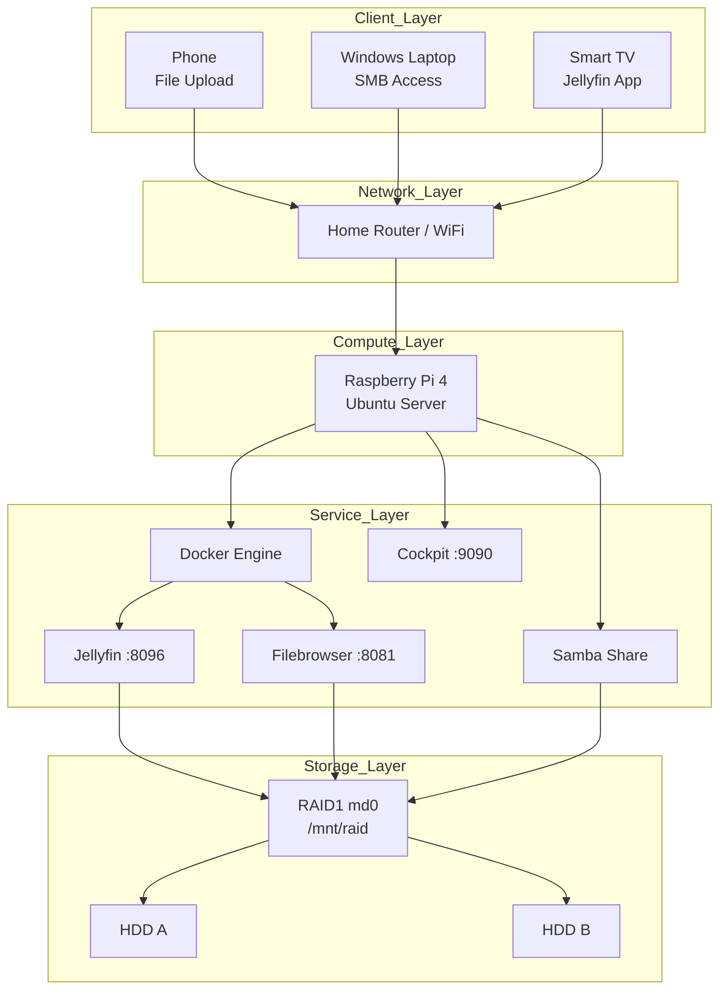

## 🧱 Layered Architecture (High-Level)

```mermaid
flowchart TB

  %% Client Layer
  subgraph Client_Layer
    Phone["Phone\nFile Upload"]
    Laptop["Windows Laptop\nSMB Access"]
    TV["Smart TV\nJellyfin App"]
  end

  %% Network Layer
  subgraph Network_Layer
    Router["Home Router / WiFi"]
  end

  %% Compute Layer
  subgraph Compute_Layer
    Pi["Raspberry Pi 4\nUbuntu Server"]
  end

  %% Service Layer
  subgraph Service_Layer
    Docker["Docker Engine"]
    Jellyfin["Jellyfin :8096"]
    Filebrowser["Filebrowser :8081"]
    Samba["Samba Share"]
    Cockpit["Cockpit :9090"]
  end

  %% Storage Layer
  subgraph Storage_Layer
    RAID["RAID1 md0\n/mnt/raid"]
    DiskA["HDD A"]
    DiskB["HDD B"]
  end

  %% Connections
  Phone --> Router
  Laptop --> Router
  TV --> Router

  Router --> Pi

  Pi --> Docker
  Docker --> Jellyfin
  Docker --> Filebrowser

  Pi --> Samba
  Pi --> Cockpit

  Jellyfin --> RAID
  Filebrowser --> RAID
  Samba --> RAID

  RAID --> DiskA
  RAID --> DiskB
```
